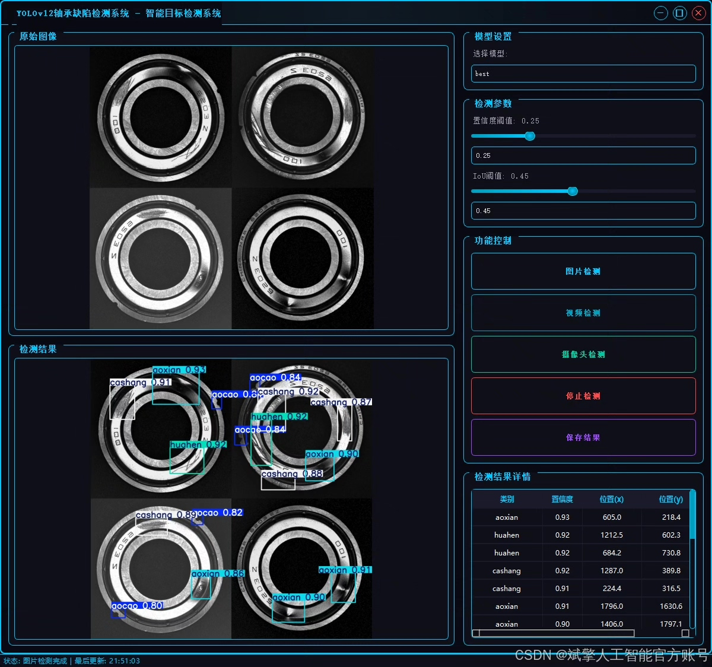
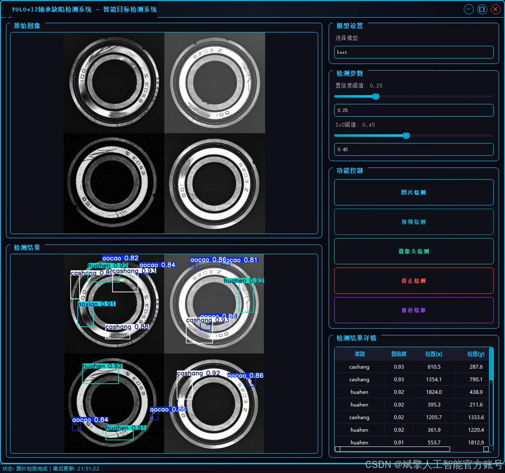
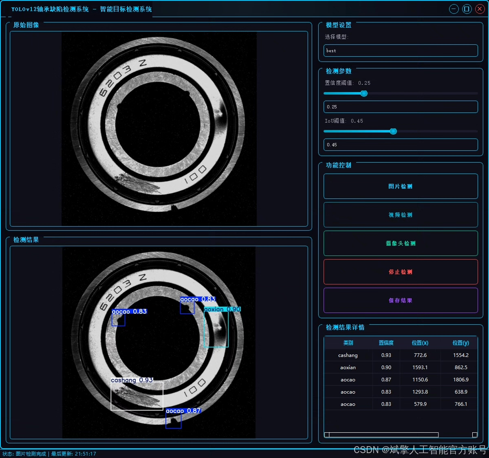
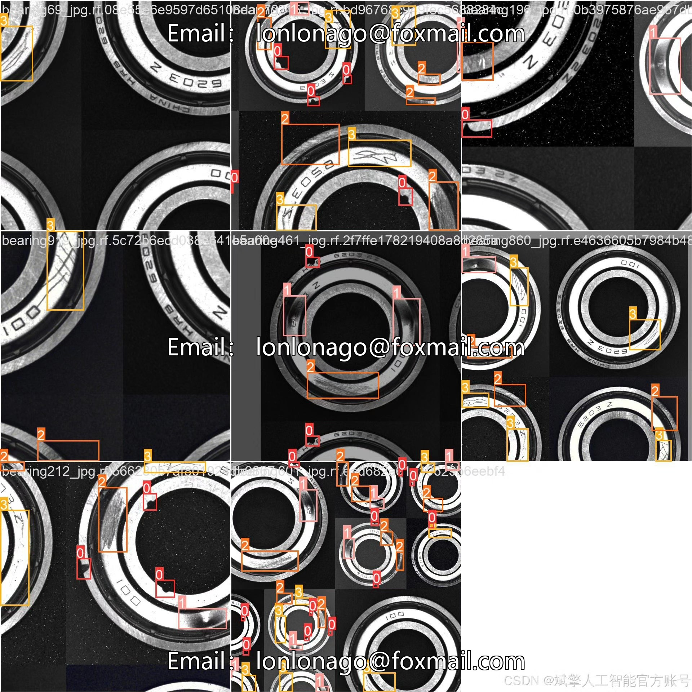
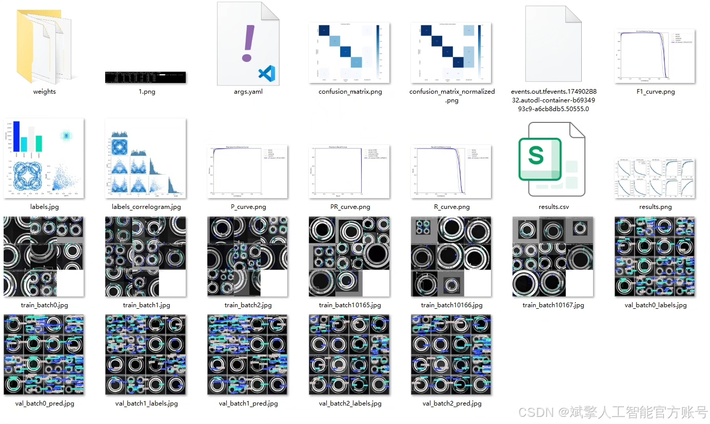
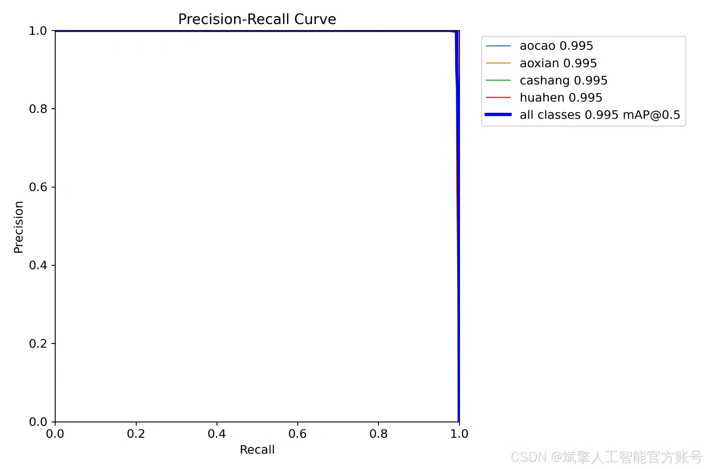
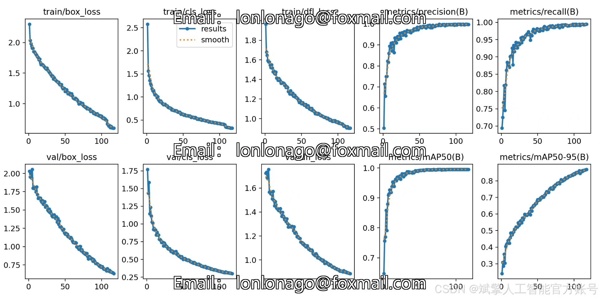
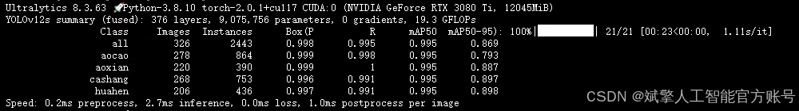
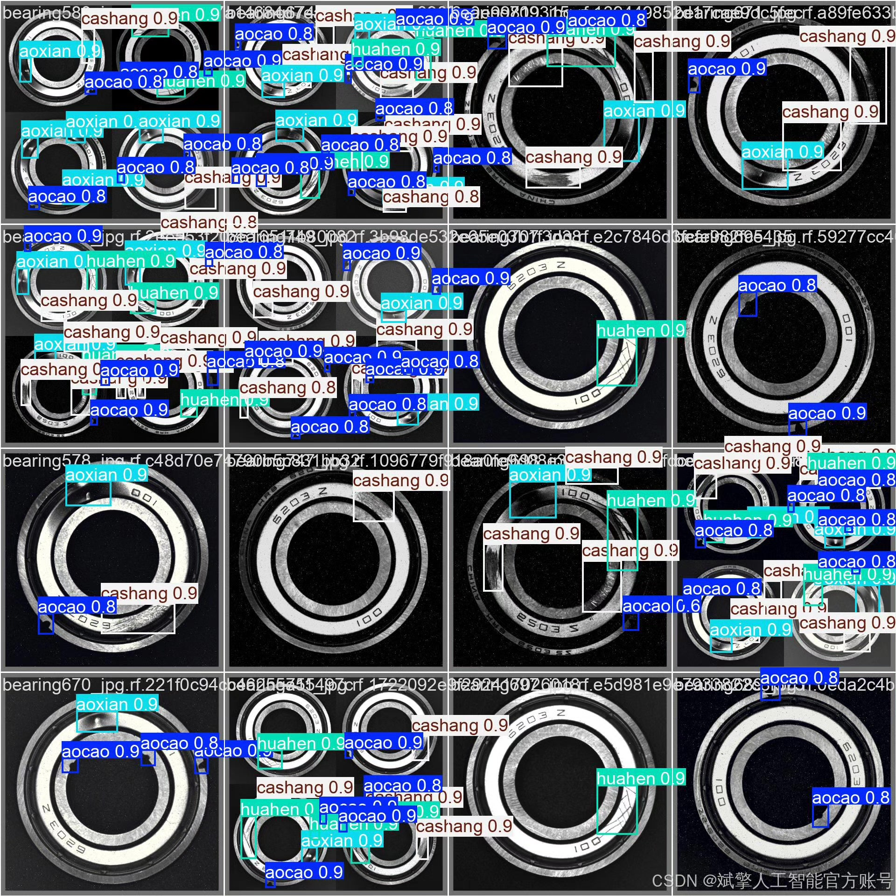

# YOLOv12 bearing defect detection software resource sharing

## Body

YOLOv12 is a deep learning-based object detection system that can be used for detecting defects in bearings. The software resource shared here includes the following components:

1. YOLOv12 dataset: This dataset contains images of bearings with various defects, which are used to train and test the YOLOv12 model.

2. UI interface: This interface provides users with an easy-to-use interface for interacting with the software. It includes functions such as loading images, displaying results, and saving models.

3. Login/Registration interface: This interface allows users to log in and register their accounts, which is necessary for accessing the software resources.

4. Python project source code: This source code includes the implementation of the YOLOv12 model, as well as other components such as the UI interface and login/registration interface.

5. Model: The YOLOv12 model is trained on the YOLOv12 dataset and can be used to detect defects in bearings.

As a key component in mechanical equipment, the health status of bearings directly affects the efficiency and safety of the equipment. Traditional bearing defect detection methods rely on manual inspection, which has low efficiency and strong subjectivity. To address this issue, this paper proposes a bearing defect recognition detection system based on deep learning YOLOv12, which can efficiently and accurately identify surface defects of bearings. The system adopts an improved YOLOv12 object detection algorithm and trains on a dataset containing four types of defects (grooves, pits, scratches, and scratches), with a training set of 759 images and a validation set of 326 images. Experimental results show that the system has high recognition accuracy and robustness in the bearing defect detection task. Additionally, the system is equipped with a user-friendly UI interface, supports login and registration functions, making it convenient for deployment and application in practical industrial scenarios.

✅ User Login and Registration: Supports password detection and security verification.
✅ Three detection modes: Based on the YOLOv12 model, supports image, video, and real-time camera detection, accurately identifying targets.
✅ Dual-screen comparison: Displays the original scene and detection results on the same screen.
✅ Data visualization: Real-time table displays the category, confidence, and coordinates of detected targets.
✅ Intelligent parameter adjustment: Offers a confidence slide bar to dynamically optimize detection accuracy, adapting to different scene requirements.
✅ Sci-fi style interface: Dark theme combined with dynamic light effects, reducing visual fatigue and enhancing operational experience.

## Images

## Payment

Here is a pay link on Stripe ( https://buy.stripe.com/3cs8yP7sY87d0vu9AB ). Please contact me lonlonago@foxmail.com after funding $89, and I will send you a complete data files , thank you!

